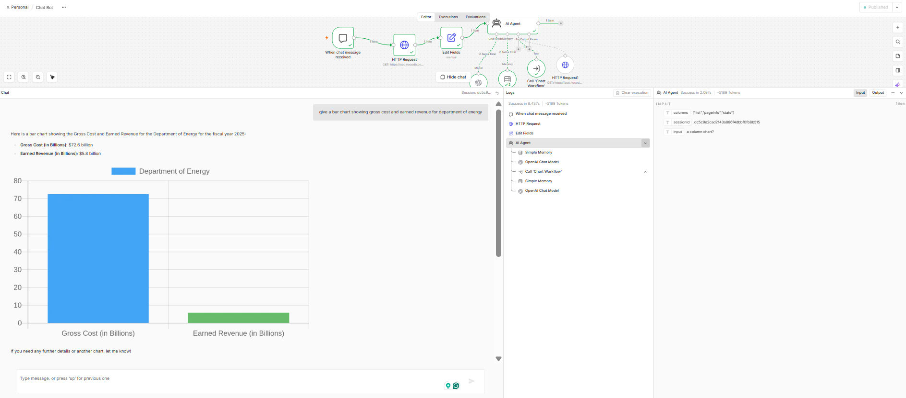

# AI Financial Data Analysis & Visualization with n8n

> Natural-language financial data analysis and automated chart generation using n8n, NocoDB, AI and QuickChart.

## Live Data

The project uses a NocoDB table containing U.S. government financial information.

**NocoDB data view:**  
https://app.nocodb.com/nc/view/930ca0ca-b5e5-489d-81eb-4a0b9000a95c

> Note: access to the NocoDB view depends on the sharing/visibility settings of the NocoDB account.

---

## Project Overview

This project demonstrates an AI-powered financial data analysis workflow built in **n8n**.

A user can ask a natural-language question about financial data. The workflow retrieves relevant records from **NocoDB**, passes the information to an AI Agent for analysis, and calls a dedicated chart-generation subworkflow when a visualization is requested.

The chart workflow converts the supplied data into a structured **Chart.js configuration** and prepares a **QuickChart** URL for visualization.

### Example question

> Give a bar chart showing gross cost and earned revenue for the Department of Energy.

### Example result

The workflow returns a natural-language explanation together with a generated bar chart.



---

## Workflow Architecture

```text
User Question
      |
      v
n8n Chat Trigger
      |
      v
NocoDB REST API
      |
      v
Edit Fields
      |
      v
AI Agent
      |
      +--------------------------+
      |                          |
      | Normal question          | Chart requested
      v                          v
Natural-language answer     Chart Workflow
                                  |
                                  v
                             Chart AI Agent
                                  |
                                  v
                       Structured Output Parser
                                  |
                                  v
                              Edit Fields
                                  |
                                  v
                              QuickChart
```

---

## Main Workflow

The main workflow receives the user's question, retrieves financial data and uses an AI Agent to analyse the request.

### Main workflow components

1. **When chat message received**  
   Receives the user's natural-language question.

2. **HTTP Request**  
   Retrieves records from the NocoDB REST API.

3. **Edit Fields**  
   Prepares the available columns, session ID and user input.

4. **AI Agent**  
   Analyses the user's request using the financial dataset.

5. **NocoDB HTTP Request Tool**  
   Allows the AI Agent to retrieve relevant records.

6. **Call 'Chart Workflow'**  
   Calls the reusable chart-generation subworkflow when the user requests a visualization.

---

## Chart Workflow

The chart workflow is a reusable n8n subworkflow dedicated to visualization.

```text
When Executed by Another Workflow
              |
              v
          AI Agent
              |
              v
   Structured Output Parser
              |
              v
         Edit Fields
              |
              v
         QuickChart URL
```

### Chart workflow process

1. Receives chart data from the main workflow.
2. Sends the chart data to the Chart AI Agent.
3. Generates a Chart.js configuration.
4. Validates the structured output.
5. Builds a QuickChart URL.
6. Returns the visualization response to the calling workflow.

---

## Example

### User question

```text
Give a bar chart showing gross cost and earned revenue
for the Department of Energy.
```

### Workflow response

The workflow identified:

- **Gross Cost:** 72.6 billion
- **Earned Revenue:** 5.8 billion

and generated a bar chart comparing the two values.

---

## Example Chart.js Configuration

The chart-generation workflow uses a structured configuration similar to:

```json
{
  "type": "bar",
  "data": {
    "labels": [
      "Department of Labor",
      "Department of Defense"
    ],
    "datasets": [
      {
        "label": "Gross Cost (in Billions)",
        "data": [
          62.5,
          1115.4
        ]
      }
    ]
  },
  "options": {
    "responsive": true,
    "plugins": {
      "title": {
        "display": true,
        "text": "Gross Cost Comparison"
      }
    }
  }
}
```

---

## Technologies Used

- **n8n** — workflow automation and AI orchestration
- **NocoDB** — database and REST API
- **OpenAI / Anthropic** — AI models used by the workflows
- **QuickChart** — chart generation
- **Chart.js** — chart configuration
- **JSON** — structured data exchange
- **REST API** — data retrieval and visualization integration
- **GitHub** — version control and portfolio presentation

---

## Key Skills Demonstrated

- Data analysis
- AI workflow automation
- REST API integration
- JSON data handling
- Natural-language data querying
- Prompt engineering
- Structured AI output
- Data visualization
- Workflow orchestration
- n8n subworkflow design
- NocoDB
- Chart.js
- QuickChart

---

## Repository Structure

```text
AI-Financial-Data-Analysis-n8n/
│
├── README.md
├── LICENSE
├── .gitignore
├── CV-Project-Entry.md
├── GitHub-Short-Description.md
├── UPLOAD-CHECKLIST.md
│
├── workflow/
│   ├── Main-Chat-Workflow.json
│   └── Chart-Workflow.json
│
├── screenshots/
│   ├── 02-chart-workflow-execution.png
│   └── 05-generated-chart-chat-demo.png
│
└── demo/
    └── generated-chart-preview.png
```

The repository now includes the **actual exported n8n workflow JSON files** used to build the project.

---

## Workflow Files

### Main Chat Workflow

`workflow/Main-Chat-Workflow.json`

Contains the chat trigger, NocoDB retrieval, AI Agent, memory, NocoDB tool and Chart Workflow tool.

### Chart Workflow

`workflow/Chart-Workflow.json`

Contains the workflow trigger, chart AI Agent, Structured Output Parser, QuickChart URL construction and AI model.

---

## Security

API credentials and authentication tokens are intentionally **not included** in this repository.

The exported Main Chat Workflow references an n8n NocoDB credential by its credential name/ID, but the actual token is not present in the exported JSON.

Do not upload:

- NocoDB API tokens
- OpenAI API keys
- Anthropic API keys
- Google Gemini API keys
- Other authentication credentials
- Private environment variables

Credentials should be configured directly inside n8n.

---

## Example User Flow

### Step 1 — User asks a question

```text
Give a bar chart showing gross cost and earned revenue
for the Department of Energy.
```

### Step 2 — NocoDB provides the financial data

The workflow retrieves the relevant records from the NocoDB REST API.

### Step 3 — AI Agent analyses the request

The AI Agent identifies the relevant agency, financial measures and records.

### Step 4 — Chart Workflow is called

The main AI Agent passes chart data to the reusable Chart Workflow.

### Step 5 — Structured chart configuration is generated

The Chart AI Agent produces a Chart.js configuration.

### Step 6 — QuickChart URL is created

The workflow converts the configuration into a QuickChart URL and returns the visualization.

---

## Future Improvements

- Add additional chart types
- Improve natural-language query handling
- Add filtering by fiscal year
- Add filtering by agency
- Add trend analysis over time
- Add automated financial reports
- Add additional financial datasets
- Improve chart formatting and styling
- Add more advanced analytical questions

---

## Author

**Shivinder Pal Singh**

Master's in Data Analytics

This project is part of my data analytics and AI automation portfolio, demonstrating practical application of data analysis, APIs, AI agents, workflow automation and data visualization.
